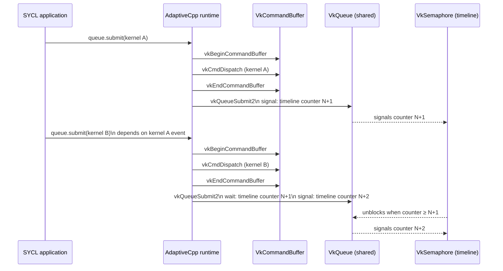

SYCL's promise is performance portability: write modern C++ once and execute across many different accelerators. But that
promise only goes as far as the available backends. While desktop and HPC platforms capitalize on established OpenCL,
CUDA, HIP, and Level Zero backends for accelerating SYCL applications on the GPU, mobile isn't a domain commonly associated
with SYCL. Yet almost every Android device ships with a capable Vulkan implementation, making it an unfulfilled chapter of
the SYCL performance portability story.

While projects such as [Sylkan](https://dl.acm.org/doi/10.1145/3456669.3456683) have demonstrated that SYCL over Vulkan is
feasible, the space has remained relatively unexplored in terms of feature completeness, Android support, and integration
with the wider SYCL ecosystem. OpenCL has had more success in this area with projects such as
[clvk](https://github.com/kpet/clvk), [pocl](https://github.com/pocl/pocl), and [ANGLE](https://github.com/google/angle)
successfully layering its compute API over Vulkan.

There are two halves of bringing up a backend target in SYCL, the runtime and the compiler. This post gives an overview
of what's going on under the hood in AdaptiveCpp before showing how to build and use the Vulkan backend. Whether you're
interested in SYCL internals, Vulkan compute, or Android development, you should have enough information to build the
backend, understand the implementation, and try it out yourself.

# Runtime Implementation Overview

The AdaptiveCpp backend runtime implementation maps the SYCL API and semantics down to underlying backend API calls.
Vulkan has a powerful, but very verbose API, so the [VulkanHpp](https://github.com/KhronosGroup/Vulkan-Hpp) headers
are used to reduce implementation verbosity.

Each SYCL device corresponds to a logical Vulkan device that meets the key capability criteria to implement SYCL,
namely [Timeline Semaphores](https://docs.vulkan.org/refpages/latest/refpages/source/VK_KHR_timeline_semaphore.html)
and [Buffer Device Address](https://docs.vulkan.org/refpages/latest/refpages/source/VK_KHR_buffer_device_address.html).

## Timeline Semaphores

To elaborate on why those extensions are necessary building blocks of our SYCL implementations. Each `sycl::queue::submit()`
call becomes a `vkCommandBuffer` submission with a single command, which is synchronized entirely using a timeline semaphores.
The timeline semaphore is owned by a SYCL queue with a value that is initialized to zero and incremented by each command
submission. This allows the same synchronization primitive to be reused many times without resetting, unlike a `vkFence`, and
each command to be uniquely identified by the pair of queue handle and timeline value. What's more a timeline semaphore can
also be signaled from host which is useful for reasons we'll discuss in a moment.



## Buffer Device Address

In AdaptiveCpp SYCL buffers are implemented on top of USM, therefore supporting USM is a crucial requirement for
the backend. There are many types of USM in SYCL but the minimum we need to support is device USM, this gives the
user a pointer to an allocation which can be dereferenced on device, but not dereferenced on host. Unlike host/shared
USM where a pointer can be dereferenced on host or device.

Vulkan asynchronous commands operate on `VkBuffer` objects, but these themselves are backed by `VkDeviceMemory` objects
that must be allocated then bound to a `VkBuffer`. To implement USM we can't give the user a device dereferencable
pointer to `VkDeviceMemory` because Vulkan only lets the object be mapped/unmapped to a host pointer. Instead the
solution was to implement device USM as a `VkBuffer` backed by `VkDeviceMemory`, and use the Buffer Device Address API
[vkGetBufferDeviceAddress()](https://docs.vulkan.org/refpages/latest/refpages/source/vkGetBufferDeviceAddress.html) to
get a 64-bit address to that can be returned to the user for use in kernels.

Initially this seems straightforward, but there is a problem, SYCL USM `memcpy` takes pointer parameters that are
either USM allocations **or host pointers**, but `vkCmdCopyBuffer` only takes `VkBuffer` objects. We already have
the `VkBuffer` associated with the USM allocations the runtime created, but we need a way to map a host
pointer to a `VkBuffer`. This also needs to be done asynchronously, if we create a `vkBuffer` internally and copy
the host data into it straightaway we won't respect previous asynchronous commands writing to the host data
which have not yet completed. Likewise we need a way to copy the data back from the internal `VkBuffer` to
host pointer, if it was a destination memcpy operation, after the `vkCmdCopyBuffer` command has completed.

This is where timeline semaphores host signaling functionality becomes crucial! Through CPU multi-threading we can
do asynchronous host side work to copy data to/from a host pointer to `vkBuffer` while respecting the SYCL command
dependencies. Here a host worker thread can wait on and signal the timeline semaphore values of the queue.

# Compiler Implementation Overview

Layering the runtime is actually the easier half of the problem, how to compile SYCL kernels down to Vulkan
consumable shader SPIR-V is a real challenge. While SYCL kernels can already be compiled to SPIR-V for
consumption by OpenCL and Level Zero backends, this is not the same dialect of SPIR-V as Vulkan drivers
consume. Fortunately there exists an established tool for generating Vulkan SPIR-V from compute kernels,
[clspv](https://github.com/google/clspv), which is used by all the layered OpenCL-on-Vulkan implementations
to compile OpenCL-C into Vulkan SPIR-V.

The clspv tool can accept LLVM IR input as well as OpenCL-C, making it suitable for integration into AdaptiveCpp's
SSCP compilation flow. This runtime JIT compilation flow allows backends to lower LLVM IR for the device using the most
appropriate tooling for that backend. So OpenCL/Level-Zero backends can call into the LLVM-SPIRV translator to lower
LLVM-IR to kernel capability SPIR-V, and the Vulkan backend can call into `clspv` in a similar way.

clspv typically expects OpenCL-C input rather than C++ single-source IR,
so there is a significant amount of work that needs to be performed via LLVM passes to transform that IR
into a form that's consumable by clspv.

The biggest challenge here is generic pointers. In the OpenCL C 1.2 language clspv is used to consuming, pointers
always have an address space qualifier to tell the compiler if it's a `__global`, `__local`, `__constant`, or
`__private` address space pointer. In SYCL however there are no such qualifiers and the address space of all
pointers must be inferred. This is possible in most cases but breaks down when pointers themselves are
loaded from memory, as there is no way to correctly infer the address space. So the SSCP Vulkan backend
does a lot of work to try restore the LLVM address space in IR, but ultimately this is a fundamental
mismatch between SYCL generic pointers and SPIR-V.

Once we have generated the SPIR-V for our kernels it will advertise specific capabilities that a Vulkan
driver must support to run it. More advanced SYCL kernels require more capabilities but the baseline
SPIR-V capability support to run any kernel are:

* `physicalStorageBufferAddresses` - Use `PhysicalStorageBuffer64` memory
  model where physical pointers are allowed. This allows USM pointers to
  be used in the kernel which are used in AdaptiveCpp to implement SYCL
  buffers as well as USM.
* `shaderInt64` - Enables 64-bit integers in SPIR-V, allows the SYCL runtime
  to pass pointer parameters to a kernel as `i64` members of a SPIR-V
  push constant struct
* `variablePointers` - Allows a SPIR-V pointer to not statically know what
  object it comes from. Enables use of `OpPtrAccessChain` SPIR-V instruction
  which are required to create a pointer to the physical pointer member inside
  the push constant parameters struct.

# Using the AdaptiveCpp Vulkan Backend

When it comes to using the Vulkan AdaptiveCpp backend, thanks to the proliferation of Vulkan drivers
there are many platforms on which the backend can be tested. On AdaptiveCpp's GitHub CI, Linux, Windows, and macOS
are tested using Mesa llvmpipe for Linux & Windows, and MoltenVK for macOS.

In this article we'll only cover how to build and use the backend on Ubuntu using a native build flow.
Android operating systems require a more complex build process using the Android NDK to
cross compile AdaptiveCpp and other dependencies. Android cross-compilation support is currently
in review at [AdaptiveCpp#2158](https://github.com/AdaptiveCpp/AdaptiveCpp/pull/2158); in-depth
instructions will be linked here once that work is merged.

> **Note**: the Android build path described in that PR is not yet part of an AdaptiveCpp release.

## Building AdaptiveCpp With Vulkan Backend Enabled

The first main build dependencies are the [LunarG Vulkan SDK](https://vulkan.lunarg.com/sdk/home)
for SPIRV Tools, Vulkan layers & loader, and the VulkanHpp headers. The second is a `clspv` binary itself,
which can be built following the repo instructions. Finally, a Vulkan driver itself is also needed to
run on top of.

### LunarG SDK

The LunarG SDK should be available in your system path after sourcing the `setup-env.sh` script it
ships (recommend putting this in `.bashrc`)

```sh
$ wget https://sdk.lunarg.com/sdk/download/1.4.357.0/linux/vulkansdk-linux-x86_64-1.4.357.0.tar.xz
$ tar -xvf vulkansdk-linux-x86_64-1.4.357.0.tar.xz
$ source 1.4.357.0/setup-env.sh
```

### Vulkan Driver

The Vulkan SDK comes with a `vulkaninfo` tool for printing the Vulkan drivers on your system,
at least one is required to use as a SYCL backend device. If you don't have any installed then the
easiest way to reliably get a driver is to install the Mesa drivers with
`apt install mesa-vulkan-drivers`. This will provide at least the llvmpipe CPU Vulkan driver
which provides all the necessary capabilities for SYCL.

```sh
$ vulkaninfo --summary
GPU0:
	apiVersion         = 1.4.318
	driverVersion      = 25.2.8
	vendorID           = 0x10005
	deviceID           = 0x0000
	deviceType         = PHYSICAL_DEVICE_TYPE_CPU
	deviceName         = llvmpipe (LLVM 20.1.8, 256 bits)
	driverID           = DRIVER_ID_MESA_LLVMPIPE
	driverName         = llvmpipe
	driverInfo         = Mesa 25.2.8-0ubuntu0.25.10.2 (LLVM 20.1.8)
	conformanceVersion = 1.3.1.1
	deviceUUID         = 6d657361-3235-2e32-2e38-2d3075627500
	driverUUID         = 6c6c766d-7069-7065-5555-494400000000
```

### clspv

The exact commit of clspv should be checked in AdaptiveCpp CI and `doc/install-vulkan.md`.

```sh
$ git clone https://github.com/google/clspv
$ cd clspv
$ python3 utils/fetch_sources.py
$ mkdir build && cd build
$ cmake .. -GNinja
$ ninja
$ export CLSPV_BIN_DIR=$PWD/build/bin
```

We export the path to the directory with the `clspv` tool so we can reference it in a
later build step.

### AdaptiveCpp

Combined with the `-DWITH_VULKAN_BACKEND=ON` option for enabling the Vulkan
backend in the build, the relevant parts of the CMake invocation are:

```sh
$ git clone https://github.com/AdaptiveCpp/AdaptiveCpp.git
$ cd AdaptiveCpp && mkdir build && cd build
$ cmake -GNinja -DWITH_VULKAN_BACKEND=ON -DCMAKE_PROGRAM_PATH=$CLSPV_BIN_DIR -DCMAKE_INSTALL_PREFIX=$PWD/install
$ ninja install
$ export ACPP_BIN_DIR=$PWD/install/bin
```

You can then check that a Vulkan device is indeed available. Note that other devices may be available too, the
below is the minimum expected

```sh
$ $ACPP_BIN_DIR/acpp-info -l
=================Backend information===================
Loaded backend 0: OpenMP
  Found device: AdaptiveCpp OpenMP host device
Loaded backend 1: Vulkan
  Found device: llvmpipe (LLVM 20.1.8, 256 bits)
```

## Compiling and running AdaptiveCpp applications with Vulkan backend

```cpp
int main() {
    sycl::device d{sycl::default_selector{}};
    sycl::queue q(d, sycl::property::queue::in_order());

    std::string device = d.get_info<sycl::info::device::name>();
    std::cout << "Default-selected queue runs on device: " << device << std::endl;

    constexpr size_t N = 1024;
    int *devicePtr = sycl::malloc_device<int>(N, q);

    q.parallel_for(N, [=](sycl::id<1> idx) {
      devicePtr[idx] = idx;
    });

    std::vector<int> dataHost(N);
    q.copy(devicePtr, dataHost.data(), N).wait();

    bool success = true;
    for (int i = 0; i < N; i++) {
      success = success && (dataHost[i] == i);
    }

    std::cout << (success ? "SYCL application SUCCESS" : "SYCL application FAILED")
              << std::endl;

    sycl::free(devicePtr, q);
    return 0;
}
```

```sh
$ $ACPP_BIN_DIR/acpp sycl_test.cpp -o sycl_test
$ ACPP_VISIBILITY_MASK=vk:llvmpipe ./sycl_test
Default-selected queue runs on device: llvmpipe (LLVM 20.1.8, 256 bits)
SYCL application SUCCESS
```

The default compilation model for the `acpp` compiler is SSCP flow, so we don't need
to specify any extra options to ask for that. Once we have our compiled `sycl_test`
binary we can run it using the `ACPP_VISIBILITY_MASK` environment variable to
ask for the Vulkan backend as `ACPP_VISIBILITY_MASK=vk`. If there is more
than one Vulkan driver on your system then you can ask for a specific one
by name, for example here we ask for llvmpipe with `ACPP_VISIBILITY_MASK=vk:llvmpipe`.

# Android Benchmarks

Returning to the Android platform, we cross compiled the nbody and mandelbrot benchmarks from
[HeCBench](https://github.com/ORNL/HeCBench) to illustrate the benefits of the SYCL acceleration
enabled by AdaptiveCpp Android support.

HeCBench provides multiple source code variants of each benchmark for different backends.
So there are OpenMP variants at [nbody-omp](https://github.com/ORNL/HeCBench/tree/master/src/nbody-omp)
& [mandelbrot-omp](https://github.com/ORNL/HeCBench/tree/master/src/mandlebrot-omp), and
SYCL variants at [nbody-sycl](https://github.com/ORNL/HeCBench/tree/master/src/nbody-sycl) &
[mandelbrot-sycl](https://github.com/ORNL/HeCBench/tree/master/src/mandlebrot-sycl).

Our cross compiled AdaptiveCpp enables both the OpenMP CPU and Vulkan backends, so we have
two SYCL runs of the SYCL HeCBench source to compare against the OpenMP implementation.

On a Qualcomm Adreno 750 GPU we observed the following results

| Benchmark           | Native OMP [1] | SYCL OMP [2] | SYCL Vulkan [3] |
|-------------------- | -------------- | ------------ | --------------- |
|`./nbody 10000 10`   | 2.49s          | 0.647417s    | TODO            |
|`./mandelbrot 100`   | 249ms          | 86ms         | TODO            |

*[1] OpenMP executable compiled directly with the NDK compiler. [2] SYCL kernel targeting AdaptiveCpp's OpenMP backend. [3] SYCL kernel targeting the Vulkan backend on the Adreno GPU.*

# Conclusion

To conclude we've introduced AdaptiveCpp's support for SYCL over Vulkan, allowing SYCL to be a valid
programming model on Android.

There is still a lot of work to do however, which is tracked in the AdaptiveCpp GitHub issues
under the [Vulkan label](https://github.com/AdaptiveCpp/AdaptiveCpp/issues?q=is%3Aissue%20state%3Aopen%20label%3Avulkan).
This includes improving the code quality by fixing bugs, in particular for Android when compiling the C++ single source
to LLVM-IR with a Aarch64 target rather than x86_64 results in different IR which is not as consumable by clspv
without some extra transformations.

There is also the opportunity for exciting application interaction via backend interop. This has not yet been implemented
for the Vulkan backend but will enable the host application to integrate between Vulkan graphics APIs and compute objects
backing SYCL.

Longer term once the project is more mature the fundamental limitations of the SYCL-on-Vulkan can be brought to the
relevant SYCL/Vulkan/SPIR-V Khronos working groups to enable explicit specification around support.
